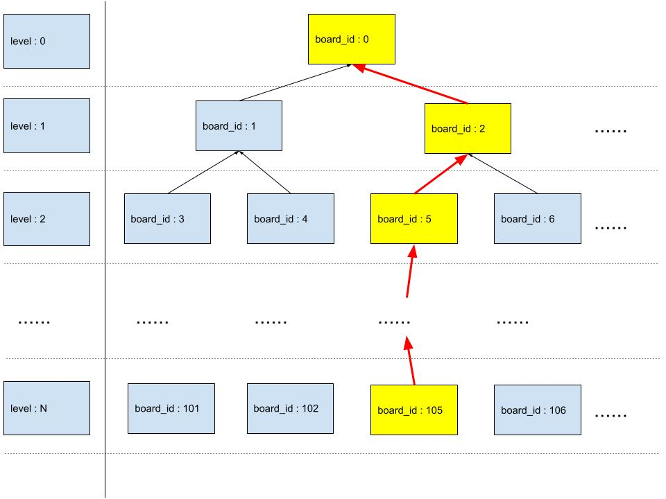

# To Estimate Steps of Solution

在完成Week8 Assignment时, 我在`mydefs.h`中定义了如下一个常数.

```c
#define CNT_LS_LEN 20
```

这篇文章解释了我是如何决定这个具体的常数的值.

## 问题的背景与产生



在解决Match Drop问题时, 我们实质上生成了一颗树状结构, 其中每个节点代表board的一种状态.
每个节点还都保存了指向parent_board的指针.

在实现solve函数中的verbose 功能的过程中. 需要依次打印出从0开始到第一个找到的解的棋盘状态.
e.g. In above diagram, the first found solved board is `board_id:105`, and then we use parent_id reference to find the trail: `[0,2,5, ...... , 105]`
因此, 需要有一个数组来储存这一系列的棋盘的`board_id`.
And in above case, the array size is `N + 1`.

And for the very first step, I need to decide the size of the array.
Since `-Wvla` is used in the given Makefile, I cant use the feature of `Variable Length Arrays` to detamine the array size when running the code.
Insted, I have to datemine the size of the array during comipler phase.

Hence, I realized that I need to find a reasonable upper limit for the array size.
It should be long enough to store the trail, but not waste too much memory space.
Apprantely, the upper limit is definately lower then 200,000.
But could we reduce it further?

Appearently, this value is only rquired when we do have a solution.

- The board have no solution.
- The board have a solution, but the first solution is beyond 200,000. In our case, this is consider as `not resovlable`
- The board have a solution, and the first solution is lower then 200,000.

All below cacalution have assumed that solution does exist.

### 其他的可能的解决办法

使用动态内存分配可以避免VLA的警告.

```c
int n = 10;
int *array = malloc(n * sizeof(int));
free(array);
```

但是在这个具体的题目下, 我非常好奇能否合理的预估出最终的solution_steps的大小.

## 符号和概念的定义

board_width
BRDSZ: definition…
MAXBRDS:  definition…
CNT_LS_LEN:  definition…        // 变量名备选: solution_size  solution_steps solution_list
n: generation_num
generation：definition…

## 具体的数学推导/展示计算过程

As a beginning, I started with the most complated case: a 6 * 6 board.

If, we assume everytime, board node could generate 6 child nodes.

| level |           | nodes number | cumulative sum |
|-------|-----------|--------------|----------------|
| 0     | pow(6, 0) |            1 |              1 |
| 1     | pow(6, 1) |            6 |              7 |
| 2     | pow(6, 2) |           36 |             43 |
| 3     | pow(6, 3) |          216 |            259 |
| 4     | pow(6, 4) |         1296 |           1555 |
| 5     | pow(6, 5) |         7776 |           9331 |
| 6     | pow(6, 3) |        46656 |          55987 |
| 7     | pow(6, 4) |       279936 |         335923 |

So at level 7, all the poosiable board node will be more then 200,000.
That means if solution exist, then it will no more then level 7, hence the solutoin array size should be 8.

But above conclusion is based on assumption that each node will ALWAYS generate 6 child nodes. Which is clearly not ture, as we do may face the duplicated board. And in that case, the solution_steps will be grater then 8.

Insated of tighten the assumptions, I think I could explor the situation of width of 5.
With same assumption and caclaution, the solution_steps will be 9.

| level |           | nodes number | cumulative sum |
|-------|-----------|--------------|----------------|
|     0 | pow(5, 0) |            1 |              1 |
|     1 | pow(5, 1) |            5 |              6 |
|   ... | ...       |          ... |            ... |
|     7 | pow(5, 7) |        78125 |          97656 |
|     8 | pow(5, 8) |       390625 |         488281 |

And when width is 4, the solution_steps will be 10.

| level |           | nodes number | cumulative sum |
|-------|-----------|--------------|----------------|
|     0 | pow(4, 0) |            1 |              1 |
|     1 | pow(4, 1) |            4 |              5 |
|   ... | ...       |          ... |            ... |
|     8 | pow(4, 8) |        65536 |          87381 |
|     9 | pow(4, 9) |       262144 |         349525 |

And when width is 3, the solution_steps will be 12.

| level |            | nodes number | cumulative sum |
|-------|------------|--------------|----------------|
|     0 | pow(3, 0)  |            1 |              1 |
|     1 | pow(3, 1)  |            3 |              4 |
|   ... | ...        |          ... |            ... |
|    10 | pow(3, 10) |        59049 |          88573 |
|    11 | pow(3, 11) |       177147 |         265720 |

And when width is 3, the solution_steps will be 18.

| level |            | nodes number | cumulative sum |
|-------|------------|--------------|----------------|
|     0 | pow(2, 0)  |            1 |              1 |
|     1 | pow(2, 1)  |            2 |              3 |
|   ... | ...        |          ... |            ... |
|    16 | pow(2, 16) |        65536 |         131071 |
|    17 | pow(2, 17) |       131072 |         262143 |

And when width is 1, I can manually compose the most complex board as below:

```text
Hawk=>A
Board=>
X
A
A
A
A
A
```

We need 6 push to squize out the annoying X on the board top.

## 结语

## 后记

这份文件是用Markdown格式编写以后转换为PDF格式的.
其中的公式部分使用了https://www.sciweavers.org/free-online-latex-equation-editor来生成基于LaTex语法的方程式图片.
图片部分使用了Google Drawings.
请问老师在具体工具上有哪些推荐?
https://www.tablesgenerator.com/markdown_tables
