# 方程组的几何解释

## 一、知识概要

本节开始，我们一起来学习线性代数的有关知识，首节我们从解方程谈起，学 习线性代数的应用之一就是求解复杂方程问题，本节核心之一即为从行图像与列 图像的角度解方程。

## 二．方程组的几何解释基础

2.1 二维的行图像

我们首先通过一个例子来从行图像角度求解方程：

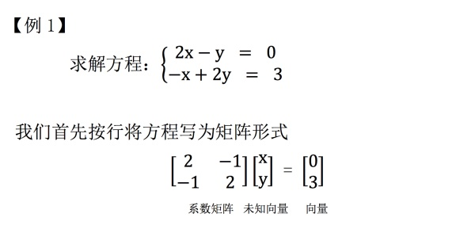

系数矩阵(A)：将方程系数按行提取出来，构成一个矩阵

未知向量(x)：将方程未知数提取出来，按列构成一个向量。

向量(b)        ：将等号右侧结果按列提取，构成一个向量

接下来我们通过行图像来求解这个方程：
所谓行图像，就是在系数矩阵上，一次取一行构成方程，在坐标系上作图。

和我们在初等数学中学习的作图求解方程的过程无异。

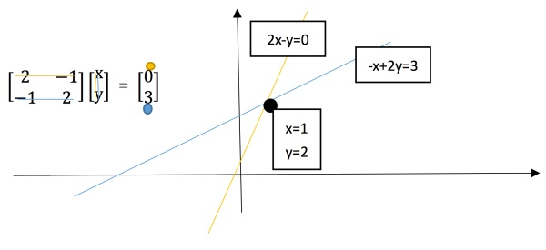

2.2 二维的列图像

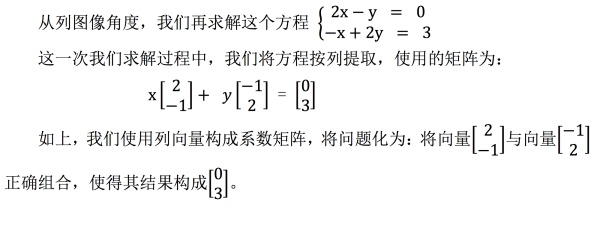

接下来我们使用列图像求解此方程：

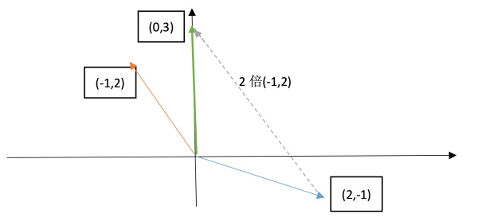

即寻找合适的 x，y 使得 x 倍的(2,-1) + y 倍的(-1,2)得到最终的向量(0,3)。在很 明显能看出来，1 倍(2,-1) + 2 倍(-1,2)即满足条件。反映在图像上，明显结果正确。

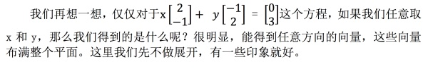

## 三.方程组的几何解释推广

3.1 高维行图像

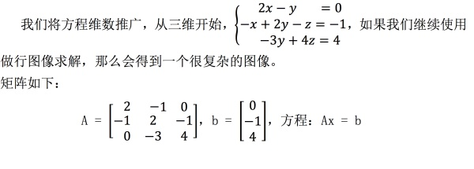

如果绘制行图像，很明显这是一个三个平面相交得到一点，我们想直接看出 这个点的性质可谓是难上加难，比较靠谱的思路是先联立其中两个平面，使其相 交于一条直线，在研究这条直线与平面相交于哪个点，最后得到点坐标即为方程 的解。

这个求解过程对于三维来说或许还算合理，那四维呢？五维甚至更高维数 呢？直观上很难直接绘制更高维数的图像，这种行图像受到的限制也越来越多。

3.2 高维列图像

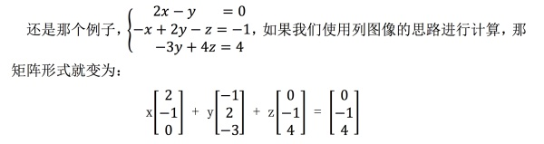

左侧是线性组合，右侧是合适的线性组合组成的结果，这样一来思路就清晰多 了，“寻找线性组合”成为了解题关键。

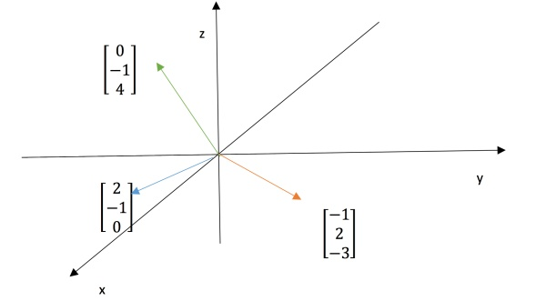

很明显这道题是一个特例，我们只需要取 x = 0，y = 0，z = 1。就得到了结 果，这在行图像之中并不明显。

当然，之所以我们更推荐使用列图像求解方程， 是因为这是一种更系统的求解方法，即寻找线性组合，而不用绘制每个行方程的 图像之后寻找那个很难看出来的点。

另外一个优势在于，如果我们改变最后的结果 b，例如本题中，

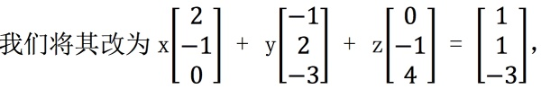

那么我们 2 −1 1 0 −3 4 −3 就重新寻找一个线性组合就够了，但是如果我们使用的是行图像呢？那意味着我 们要完全重画三个平面图像，就简便性来讲，两种方法高下立判。

另外，还要注意的一点是对任意的 b 是不是都能求解 Ax = b 这个矩阵方程呢？ 也就是对 3x3 的系数矩阵 A，其列的线性组合是不是都可以覆盖整个三维空间呢？ 对于我们举的这个例子来说，一定可以，还有我们上面 2*2 的那个例子，也可以 覆盖整个平面，但是有一些矩阵就是不行的，比如三个列向量本身就构成了一个 平面，那么这样的三个向量组合成的向量只能活动在这个平面上，肯定无法覆盖 2 −1 1 一个三维空间，

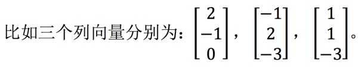

这三个向量就构

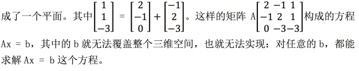

3.3 矩阵乘法

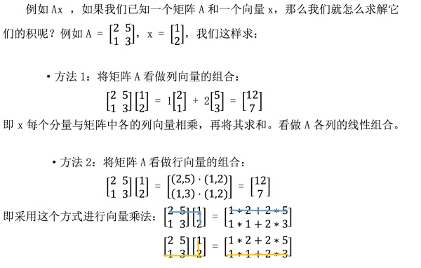

## 四、学习感悟

这部分内容是对线性代数概念的初涉，从解方程谈起，引进列空间的概念，可 以发现从列空间角度将求解方程变化为求列向量的线性组合，这个方式更加科学。 介绍了矩阵乘法，这部分内容重在理解。