## 0、前言

MIT线性代数课程精细笔记[第二课]笔记见MIT线性代数课程精细笔记[第二课]，该笔记是连载笔记，本文由坤博所写，希望对大家有帮助。

## 一、知识概要

前面介绍了向量与矩阵之间的乘法，这一节我们要介绍两个矩阵之间的乘法。 并讨论逆矩阵存在的条件。最后又介绍了求解逆矩阵的方法。

## 二、矩阵乘法

2.1 矩阵乘法最常见求解方式

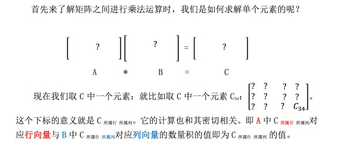

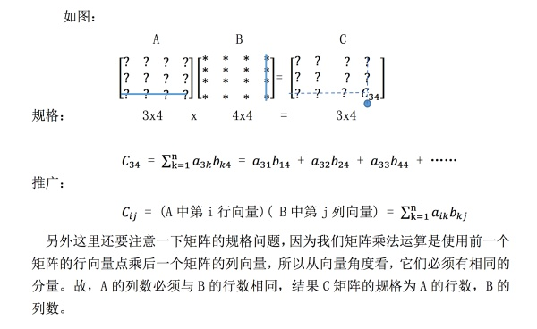

2.2 列组合与行组合方式

2.2.1 列组合：

还记得我们之前学习过矩阵与列向量的乘积，得到一个列向量：

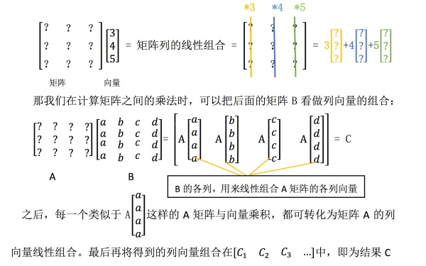

这种方法的关键就是将右侧矩阵 B 看做列向量组合，将问题转化为矩阵与向 量的乘法问题。也表明了矩阵 C 就是矩阵 A 中各列向量的线性组合，而 B 其实 是在告诉我们，要以什么样的方式组合 A 中的列向量。

2.2.2 行组合：

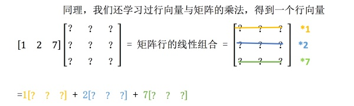

同样，按照形式，这次将矩阵 A 看做行向量组合就行了：

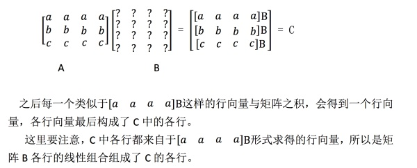

2.3 列乘以行

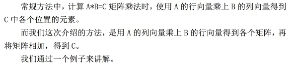

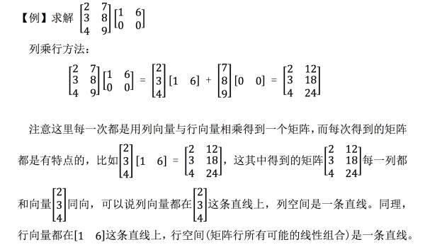

2.4.分块做乘法

分块乘法就是宏观上的矩阵乘法，比如现在有一个 50*50 的矩阵与 50*50 矩 阵相乘，一个一个进行运算很麻烦，尤其是如果矩阵在某一区域上有一定的性质， 那么我们可以将其分块，如：

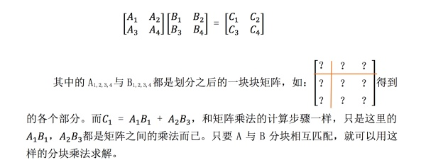

## 三．逆矩阵

3.1 逆矩阵介绍

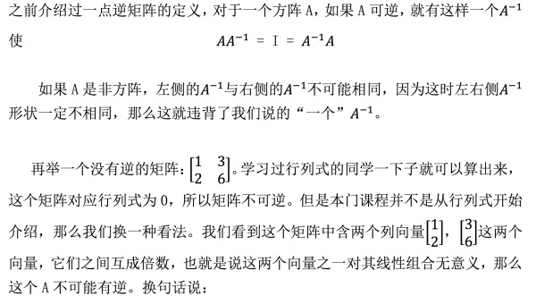

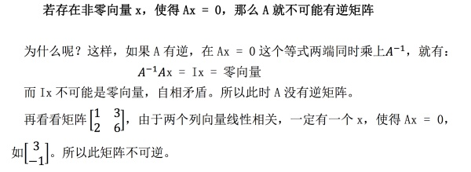

3.2 逆矩阵求解

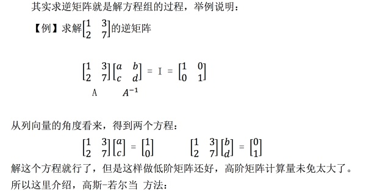

3.2.1 高斯-若尔当方法

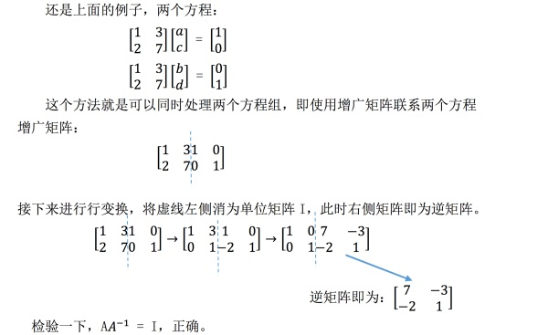

接下来论证它的合理性：

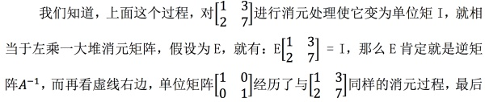

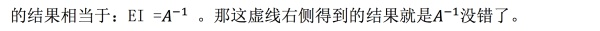

## 四．学习感悟

这节介绍了认识矩阵乘法的不同角度，并介绍了逆矩阵的相关知识以及如何 即求解逆矩阵。这节内容很好的体现了我自己认为的这门课的优点之一：少有繁 琐的证明，更多的理解与类比。多从向量，空间，线性组合的角度去认识矩阵之 间的运算，这是这门课的核心之一。

## 版权所有、未经同意，禁止转载！！！

