## 0、前言

MIT线性代数课程精细笔记[第四课]笔记见MIT线性代数课程精细笔记[第六课]该笔记是连载笔记，本文由坤博所写，希望对大家有帮助。

## 一、知识概要

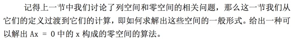

## 二．消元法求解零空间

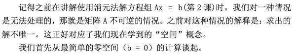

2.1 消元法确定主变量与自由变量（消元）

2.2 对自由变量赋值覆盖零空间（回代）

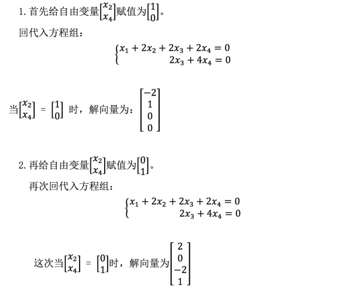

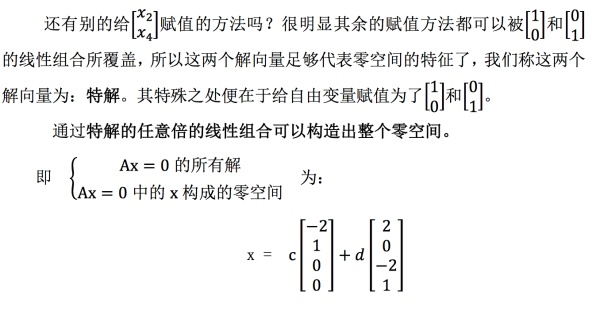

2.3 算法总结

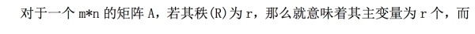

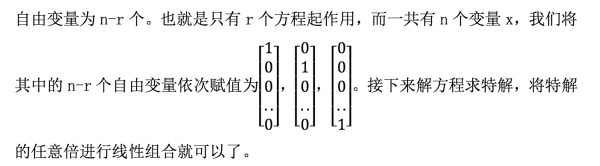

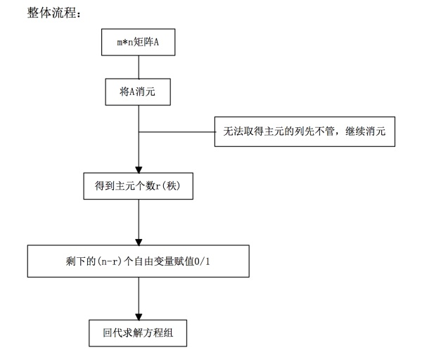

三．简化行阶梯形式

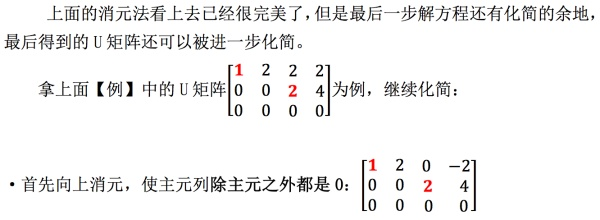

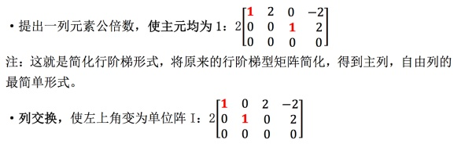

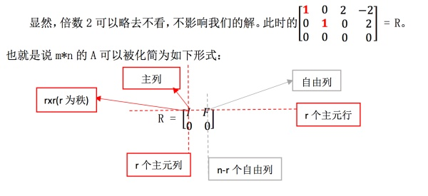

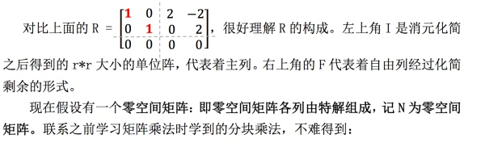

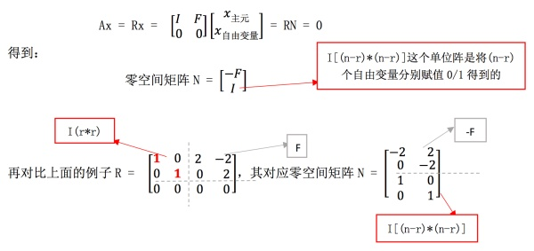

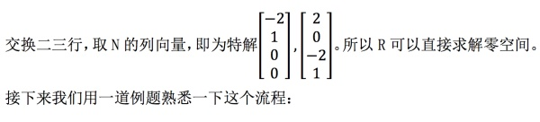

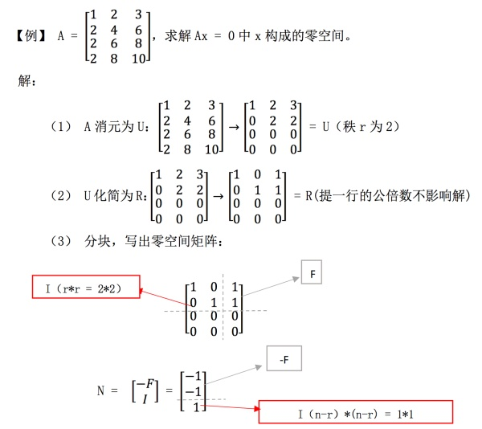

## 五.学习感悟

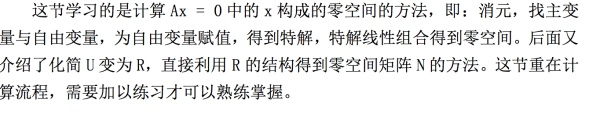

## 版权所有、未经同意，禁止转载！！！

