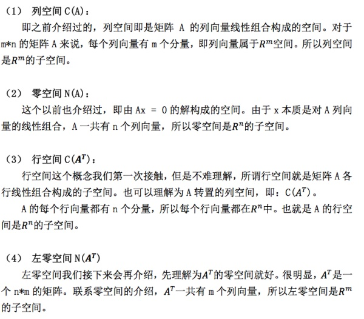
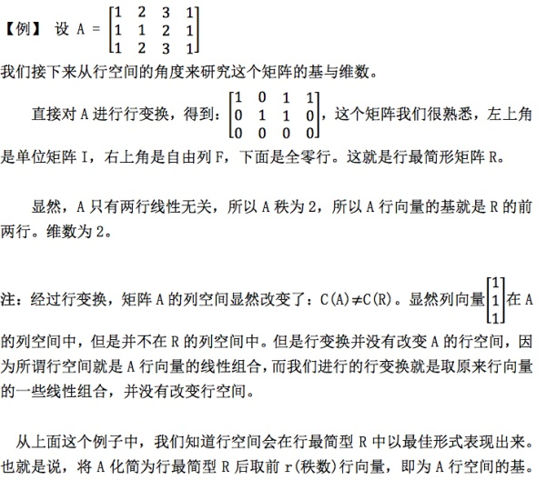
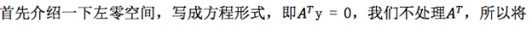
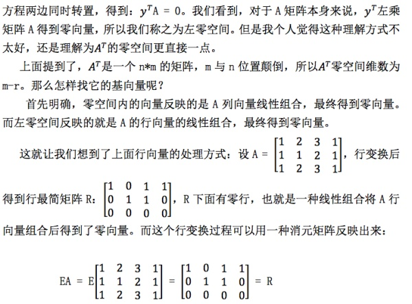
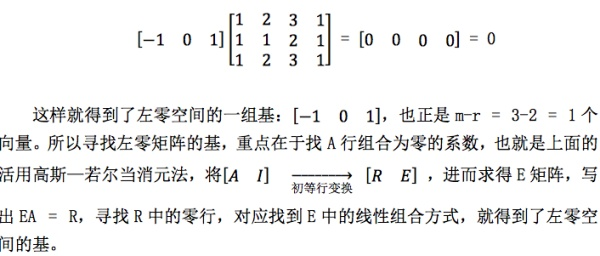
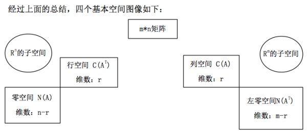
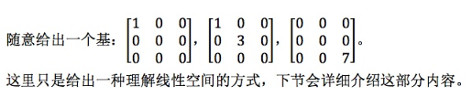

## 0、前言

MIT线性代数课程精细笔记[第二课]笔记见MIT线性代数课程精细笔记[第九课]，该笔记是连载笔记，本文由坤博所写，希望对大家有帮助。

## 一、知识概要

上面我们介绍过列空间，零空间。但是这还远远不够，对一个矩阵来说，我们 能从它身上挖掘出的空间远不止这些，所以这一节我们介绍四个基本子空间，也 是对空间概念的补充，便于我们接下来的讨论。

## 二．四个基本空间介绍：

对于一个 m*n 矩阵 A 来说，以下四个基本空间是其基础。

2.1 四个基本空间的维数与基

还是研究 m*n 的矩阵 A，其四个子空间的基本性质如下:

（1）列空间

之前介绍过列空间的基，设矩阵 A 的秩为 r，则 A 有 r 个主列，这 r 个主 列就是列空间 C(A)一组基，一组基里有 r 个向量，所以列空间维数为：r。

（2）零空间

同样，之前介绍过矩阵 A 秩为 r 时，自由列为 n-r 列。这 n-r 列决定了 x 中的 n-r 个自由变元，赋值后就构成了零空间的 n-r 个基向量，故零空间维数为：n-r。

（3）行空间

A 的行空间可以化为  的列空间。但我们这里使用的方法是直接对 A 的行 向量进行变换（其实一样），最后行空间的维数也是秩数 r。

（4)左零空间

2.2 四个基本空间图像：

## 三．矩阵空间

这是一种新的对空间的定义，实际上，线性空间的元素并不一定是实数组成 的向量，我们可以将所有 3*3 的矩阵当成一个所谓“向量空间”中的向量，只要 满足线性空间的八条规律，对线性运算封闭，就可以将其当做线性空间中的元素。 因为矩阵本身也满足线性空间的八条运算律，我们就可以将所有的 3*3 矩阵看做 一个线性空间。

这里先渗透一下这个概念，先不用深入了解，下节中会提到部分的详细内容。

总之，这里我们将所有的 3*3 矩阵看做了一个线性空间，那么它的子空间有 什么呢？

上三角矩阵，对称矩阵，对角矩阵。

而很明显，上三角矩阵与对称矩阵的交集为对角矩阵(diag)。深入研究对 角矩阵，就要给出它的基，

## 四.学习感悟

本节也是概念的渗透，介绍四个基本空间，其中比较新的内容是左零空间， 即行向量的线性组合得到零，这部分要好好理解。前面重点在于 2.2 的图，以后 会经常用到。另外给下一节开了个头，引申了向量空间概念。

## 版权所有、未经同意，禁止转载！！！

