## 0、前言

MIT线性代数课程精细笔记[第十七课]笔记见正交矩阵和 Gram-Schmidt 正交化[MIT线代第十七课]，该笔记是连载笔记，本文由坤博所写，希望对大家有帮助。

## 一、知识概要

这一节是为下面求特征值来进行铺垫，主要是要掌握求行列式的方法与行列 式的一些性质，掌握行列式一般求解过程之后这部分不是很难。由于这部分主要 在于技巧的掌握，抽象理解部分并不是很多，我这里将 18,19 课中关于行列式的 内容放在了一起。

## 二、行列式性质

行列式是跟每个方阵都有关的一个数字。这个数字包含了这个矩阵的很多性 质，例如之前介绍过的，方阵是否可逆可以根据行列式进行判断，行列式为 0， 则方阵不可逆。

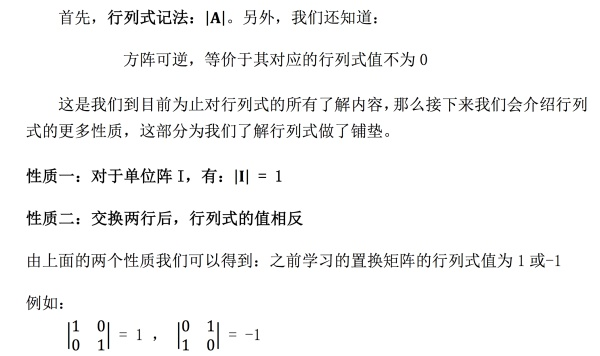

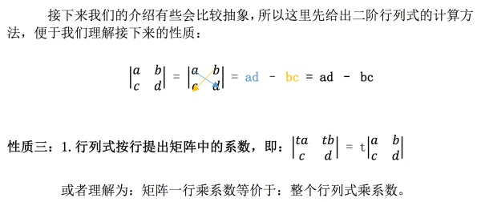

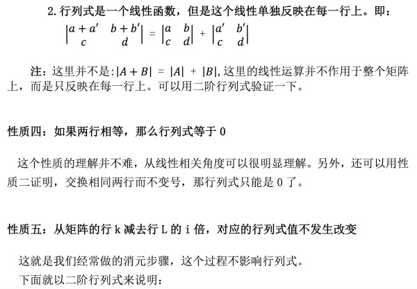

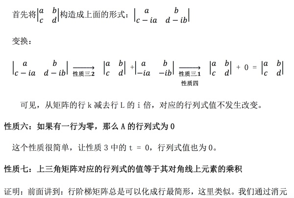

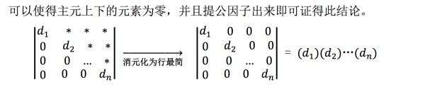

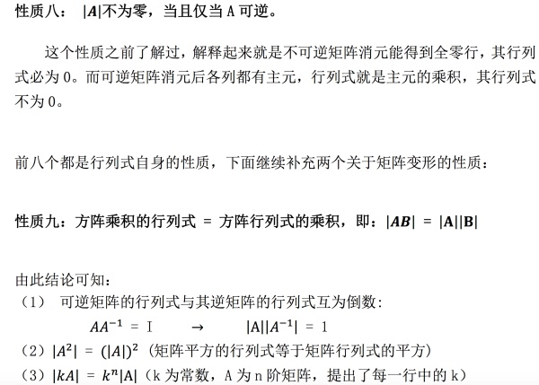

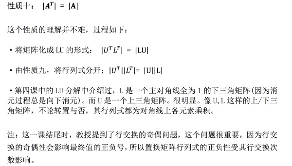

## 三、行列式公式

前面介绍的是行列式的基本性质，掌握这些性质不需要知道行列式怎么求解， 但是我们可以根据这些性质推出来行列式的一般求解过程。我们从二阶行列式谈起：

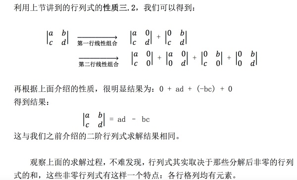

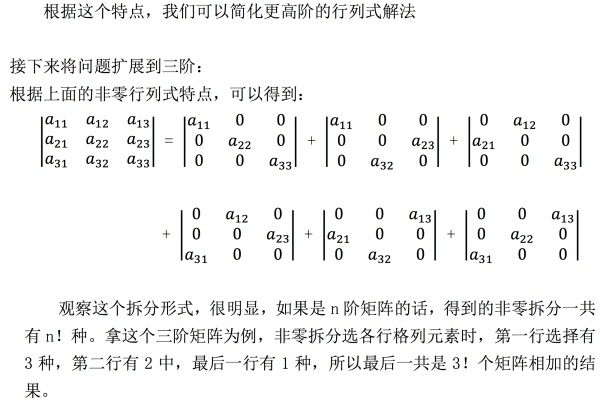

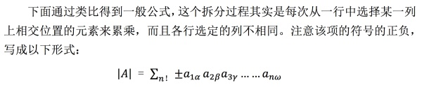

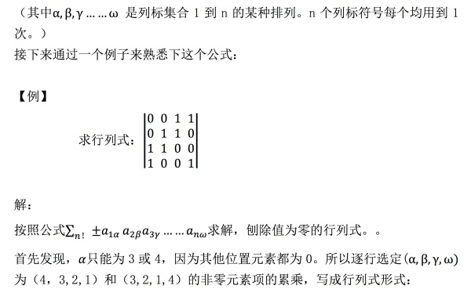

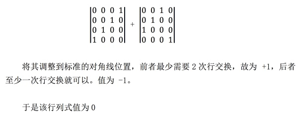

## 四、代数余子式

接下来介绍代数余子式概念，利用代数余子式我们可以更方便地求解行列式， 其作用即是将 n 阶行列式化成 n-1 阶。

根据前面所讲的公式，不难发现，在选元素做累乘时，例如从第一行中选了第 一个元素，则剩余因子从剩余的 n-1 行和 n-1 列中选取，于是剩余的因子组成一 个 n-1 阶行列式，这就是所谓代数余子式

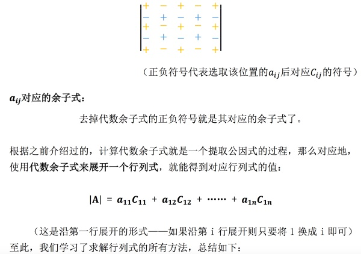

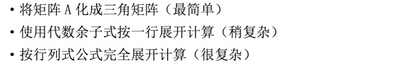

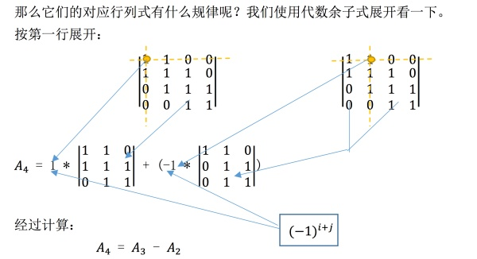

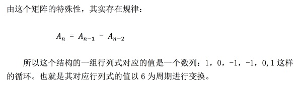

## 五、学习感悟

这两节主要围绕计算行列式的技巧展开讨论，首先介绍了行列式具有的性质， 之后引出了使用公式计算行列式的方式，最后介绍了最常用的计算行列式的方法： 代数余子式展开。这部分主要是计算技巧问题，需要理解的部分较少。

