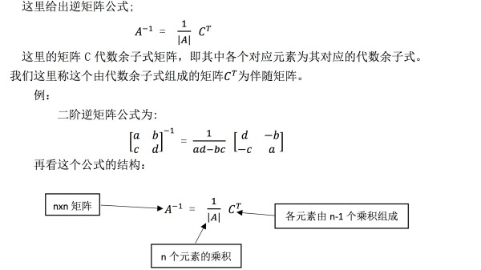
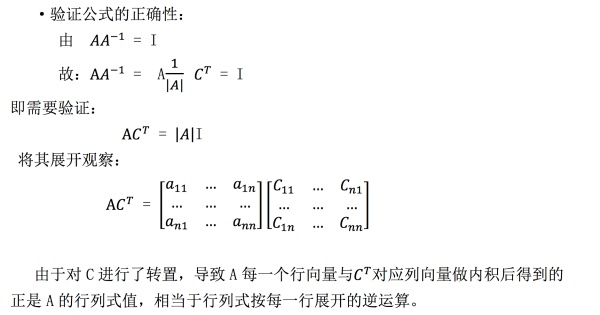
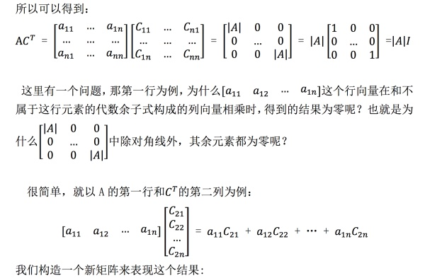
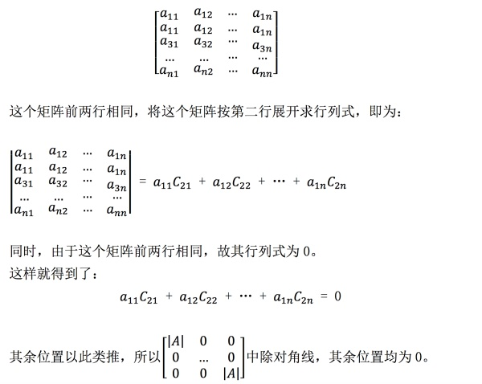
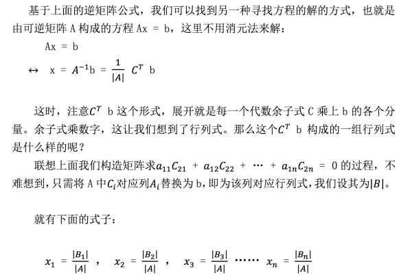
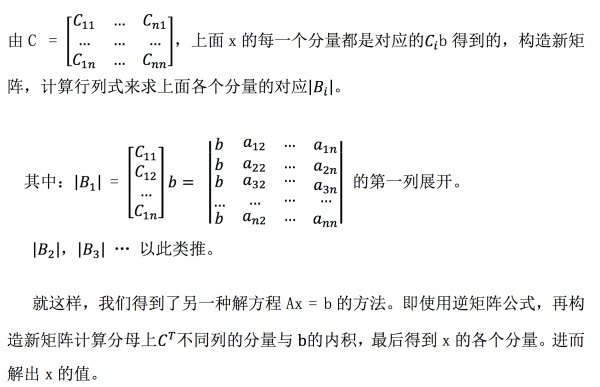
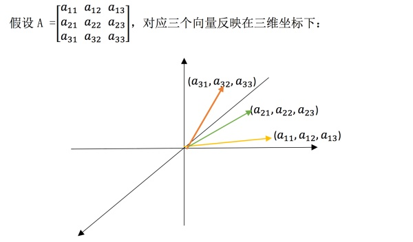
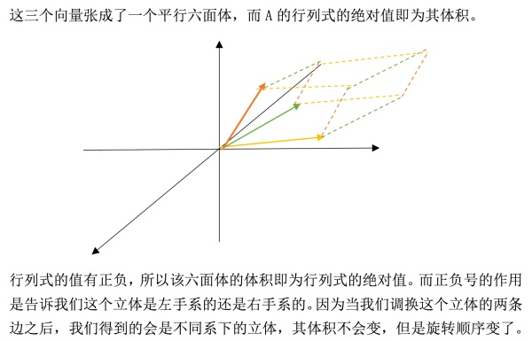
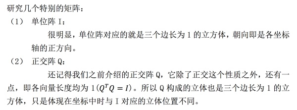
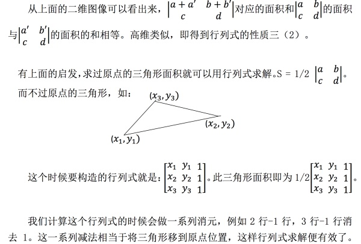

## 0、前言

MIT线性代数课程精细笔记[第十八九课]笔记见行列式介绍[MIT线代第十八九课]，该笔记是连载笔记，本文由坤博所写，希望对大家有帮助。

## 一、知识概要

上一节中我们介绍了行列式的求法，这一节强调下行列式的应用，包含三个 方面：克莱姆法则、逆矩阵、体积。这三部分内容会让我们对行列式有更深层次 的认识。

## 二．逆矩阵公式

逆矩阵公式帮助我们了解了另一种原矩阵与逆矩阵之间的关系，可以理解原 矩阵的变化对逆矩阵的影响。

## 三、克莱姆法则

## 四、体积

直接给出应用：行列式的值是一个六面体的体积。

## 五、学习感悟

这一节主要是行列式的应用，其中比较重要的是逆矩阵公式与行列式计算体 积。而克莱姆法则解方程的过程没有消元法更有效，对 Ax = b 方程，更推荐用 消元法来进行求解。

