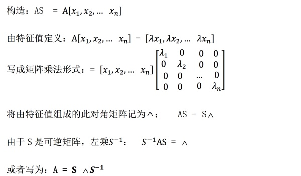
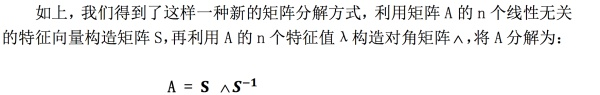
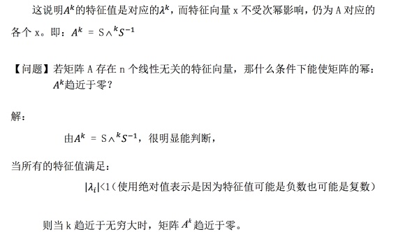
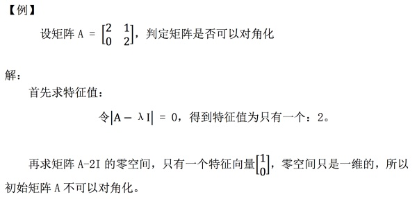
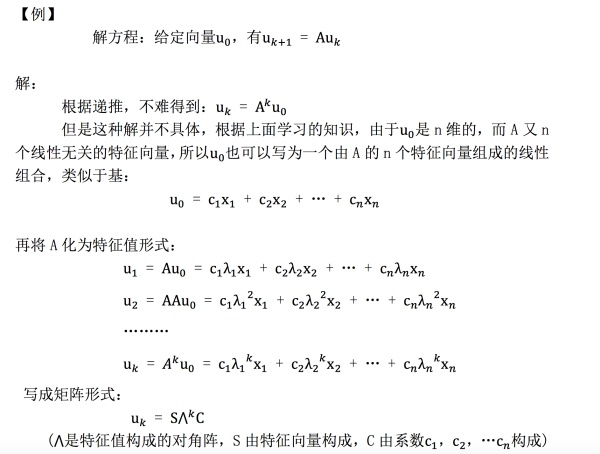
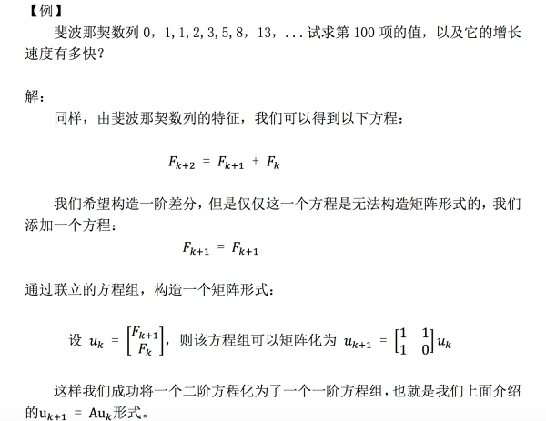
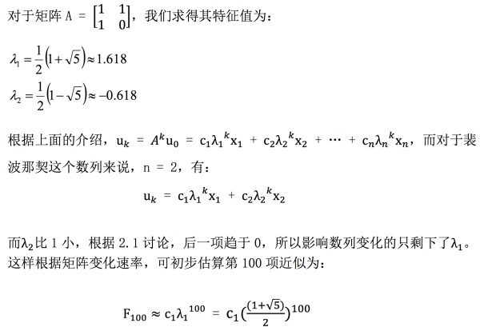
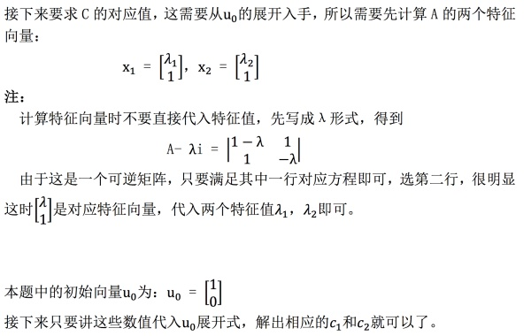
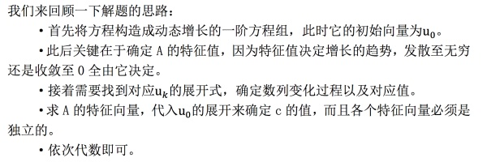

## 0、前言

MIT线性代数课程精细笔记[第二十一课]笔记见

忆臻：特征值和特征向量[MIT线代第二十一课]​zhuanlan.zhihu.com

该笔记是连载笔记，本文由坤博所写，希望对大家有帮助。

## 一、知识概要

本节课讨论了矩阵的对角化，并利用对角化分解方式简化了矩阵幂运算。最后 介绍了差分方程的应用，灵活运用线性无关的特征向量是这部分的关键。

## 二．矩阵的对角化

2.1 对角化：

所谓矩阵对角化，其实介绍的就是一种矩阵分解方式。根据我们上一节学习的 特征值与特征向量，如果 A 有 n 个线性无关的特征向量，那么可以将它们组成一 个可逆方阵，进而将矩阵分解：

假设 A 的 n 个线性无关的特征向量组成矩阵 S，有：

这种矩阵分解方式有什么用呢？记得我们之前学习过 A 的 LU 分解，QR 分 解，但是这些分解方式都无法对矩阵的幂运算起到帮助，而这种对角化分解矩阵方式对矩阵幂运算的帮助很大。

同样，使用公式也可以很明显地看出这个性质：

另外，注意矩阵是否能够成功对角化取决于该矩阵是否有 n 个线性无关的 特征向量，而特征向量与特征值之间有着紧密的联系：

如果矩阵 A 没有重复的特征值，矩阵就一定有 n 个线性无关的特征向量（这 也就意味着，不同特征值对应特征向量线性无关）

但是如果有重复的特征值，结论不是完全否定的，也就是说这时也可能存在 n 个线性无关的特征向量。例如：10x10 的单位矩阵，其特征值只有 1，但是事实 上我们可以取得 10 个线性无关的特征向量。

2.2 差分方程

有了上面对角化的知识，我们就可以解决矩阵次幂的问题了

有这样一种递推关系：

我们来举个例子熟悉下这种方程：

## 三、学习感悟

本节主要学习了矩阵的对角化分解以及差分方程的对应公式，这部分重点在 于理解特征值，特征向量的作用，并熟悉差分方程的解题流程，在这一节中我们 会发现求解特征向量与特征值的能力非常关键，是这些扩展的核心所在。

