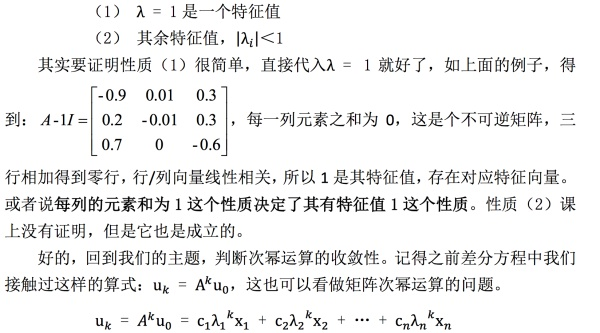
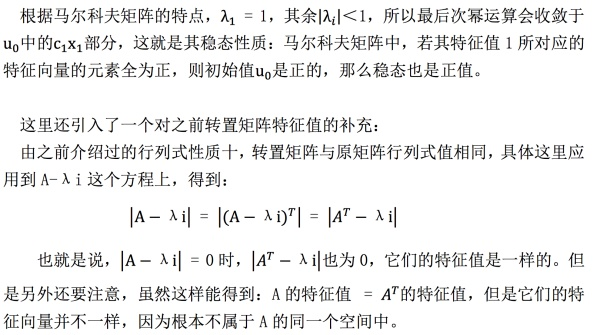
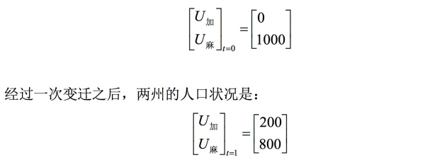
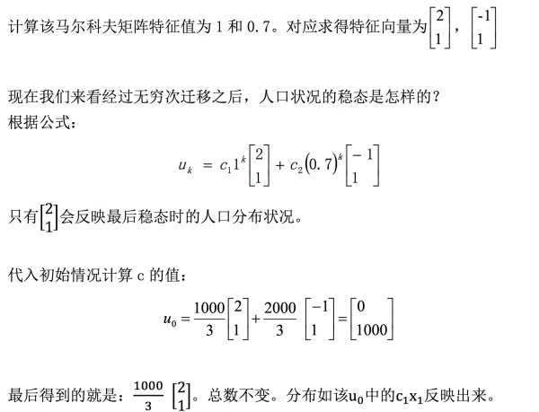
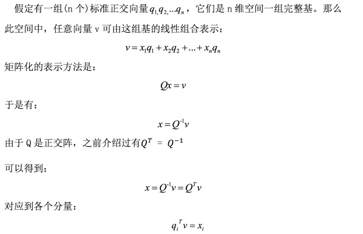
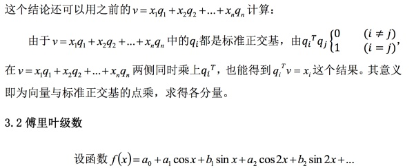
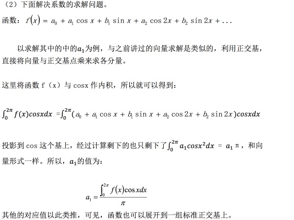

## 0、前言

MIT线性代数课程精细笔记[第二十三课]笔记见

忆臻：微分方程和矩阵指数【MIT线代第二十三课】​zhuanlan.zhihu.com

该笔记是连载笔记，本文由坤博所写，希望对大家有帮助。

视频链接：

麻省理工公开课：线性代数_全35集_网易公开课​open.163.com

## 一、知识概要

本节介绍了马尔科夫矩阵与傅里叶级数，是对特征值以及之前大量知识的一 次总结，重在理解应用，但是内容不是非常细致，主要是大体的了解。

## 二．马尔科夫矩阵的性质及其应用

2.1 马尔科夫矩阵的性质

先给出一个马尔科夫矩阵如下：

【例】

马尔科夫矩阵要满足两条性质：

（1）每个元素均为非负数

（2）每列的元素和为 1

性质：如果 A 是马尔可夫矩阵，则 A 的幂也是马尔科夫矩阵。

接下来讨论的是矩阵次幂运算的“稳态”概念，联想上一节中学习过的微分方 程中的稳态问题，那时我们是用特征值和 0 的关系来判断的，而这里的运算变为 了幂次运算，这时稳态的判断就要变化了。

这就涉及到了特征值与特征向量，研究马尔科夫矩阵的特征值，发现它的特征 值有这样的性质：

2.2 马尔科夫矩阵的应用

下面研究方程：  （其中，A 是马尔科夫矩阵）

给定 A 是 2x2 的矩阵，研究加州和麻省的人口问题，矩阵 A 表示，一年后发 生了人口的迁移。矩阵的四个元素相应表示的是留下和迁出的概率，在这个过程 中总人口数保持不变。这里有个严格的限制：那就是马尔科夫矩阵不变（即每次 变动的概率一样）。

给定等式如下形式：

（中间的矩阵表示有 0.9 的比例的人口留在加州，0.1 从加州迁移到麻省，0.8 的人留在麻省，0.2 的人迁移到加州；这是一个马尔科夫矩阵）

下面分析其稳态：

现在假定初始状态为：

## 三．傅里叶级数

3.1 前提基础

这个问题与之前的问题有什么关系？一样都是无穷维，但关键性质是函数正交。

注：

上述形式就是傅里叶级数，作用在函数空间上，用函数f(x)来代替向量v也就是使用正交函数来代替原本上面介绍的标准正交基  ...。反映到上 面的函数中，基就是 1，cosx，sinx，cos2x，sin2x...

而且傅里叶级数成立的原因即是：这些基是正交的。

(1)下面解释下函数空间下的“正交”：

我们知道，对于向量的点积为：

在这里，向量可以看做是离散的，但是上面给出的函数，它们在其定义域上 是连续的，那么对于两个连续函数而言，其内积是什么？

对比上面的向量内积的形式，对于函数而言，与之最相似的情况就是在每个x 值上的f(x).g(x)，而连续情况对应的就是对其进行积分。至于其积分上下限： 观察到函数f(x)是一个周期函数，周期为  。所以这里最好也是从 0 积分到  。

定义好函数空间的内积之后，我们可以检验一下正交性，明显可以得到傅里 叶级数中的基是正交的。

## 四、学习感悟

这部分内容重在理解，马尔科夫矩阵的重点在于理解那个人口迁移模型的应 用，而傅里叶级数实际上就是将我们之前向标准正交机投影的向量改为了空间中 向函数投影的展开形式，只要理解了正交函数的概念，这些问题便是显而易见的 了。

